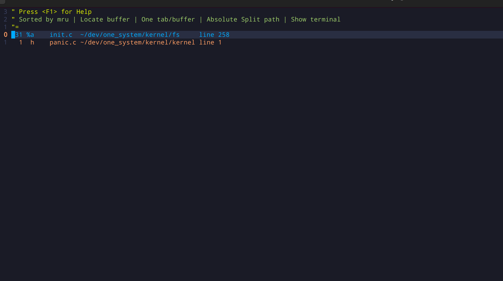
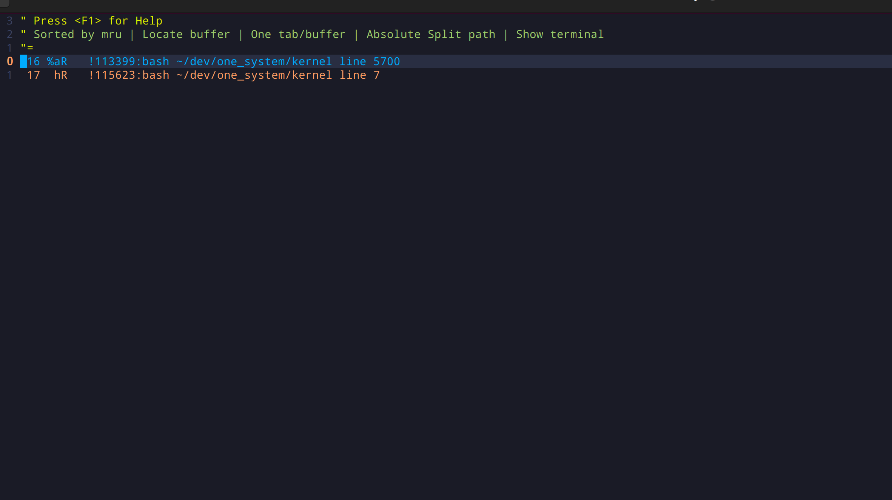
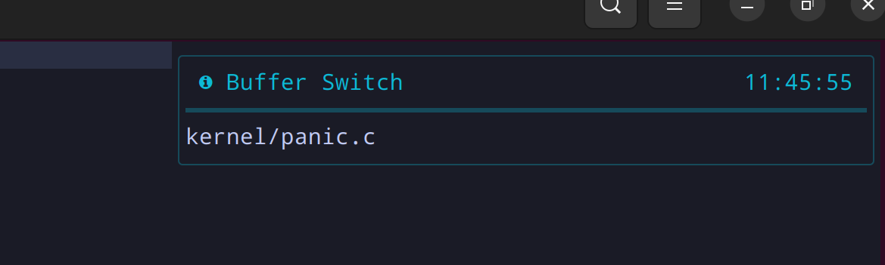
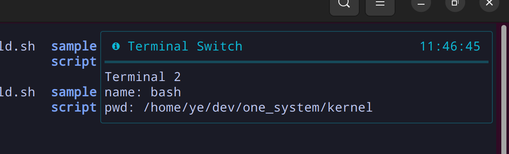

## Features

Tomatoterm.nvim is a small plugin that helps you use the terminal more seamlessly in Neovim.

It has the following features:

- A keystroke switches between normal buffers (non-terminal buffers) and terminal buffers
- Automatically enter insert mode when entering a terminal buffer, make the terminal ready to accept user input
- A keystroke switches to the next and previous normal buffer or terminal
- Send visual selection text to the terminal
- With [bufexplorer](https://github.com/rargo/bufexplorer) installed, select terminal buffers and non-terminal buffers separately

Buffer explorer  


Terminal explorer  


Switch buffer  


Switch terminal  


## Requirements

- Neovim has [Neovim notify plugin](https://github.com/rcarriga/nvim-notify) installed
- Optional [bufexplorer](https://github.com/rargo/bufexplorer) installed, a modified version bufexplorer to display terminal buffers and non-terminal buffers separately

## Default Keymaps

Terminal and normal mode:

- <C-t\>:  toggle between terminal and non-terminal buffer
- <C-n\>:  switch to next terminal or non-terminal buffer
- <C-p\>:  switch to previous terminal or non-terminal buffer
- <F12\>:  add a terminal
- <C-F12\>:  add a terminal in vertical split window


Visual mode:

- s: send visual select text to the first terminal

Please note that it is difficult to find a keymap that is easy to use and does not conflict with neovim and your shell. The default keymap is most likely a personal setting. You can change the keymap as described in the following sections.

## Bufexplorer Keymaps

Add the following keymap for terminal buffers and non-terminal buffers selecting:

```
vim.api.nvim_set_keymap('n', '<C-b>', '<cmd>BufExplorer<cr>', {noremap = true, silent = true})
vim.api.nvim_set_keymap('t', '<C-b>', '<C-\\><C-N><cmd>TerminalExplorer<cr>', {noremap = true, silent = true})
```

## Installation

Install the plugin with your preferred package manager:

### [lazy.nvim](https://github.com/folke/lazy.nvim)

```lua
{ 'rargo/tomatoterm.nvim' }
```

### Setup

Use default keymaps
```lua
require("tomatoterm").setup()
```

Modify keymaps, change those `somekey` to real key
```lua
require("tomatoterm").setup({
  keys = {
    toggle = "somekey", -- toggle between terminal and normal buffer
    next_buffer_terminal = "somekey", -- switch to next terminal or normal buffer
    prev_buffer_terminal = "somekey", -- switch to previous terminal or normal buffer
    add_terminal = "somekey", -- add a new terminal
    add_terminal_vertical_split = "somekey", -- add a new terminal in vertical split window
    visual_mode_send_to_terminal = "somekey", -- visual mode map: send visual select text to the first terminal
  }
})
```
