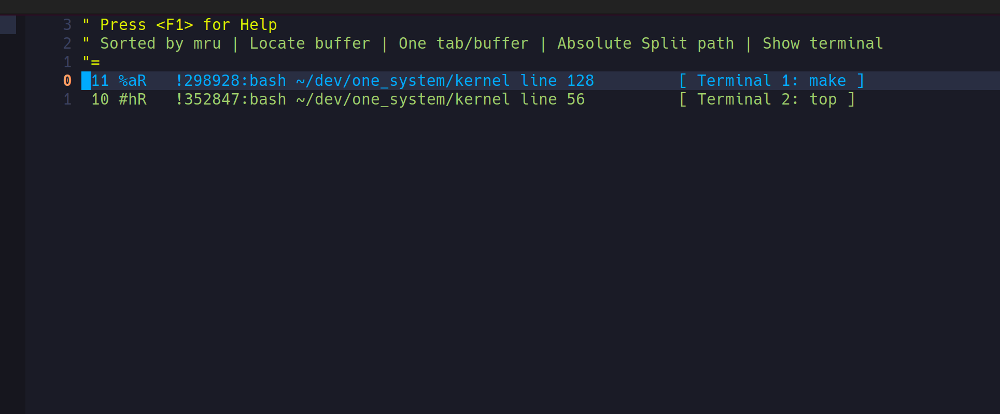

## Features

Tomatoterm.nvim is a small plugin that helps you use the terminal more seamlessly in Neovim.

It has the following features:

- A keystroke switches between normal buffers (non-terminal buffers) and terminal buffers
- Automatically enter insert mode when entering a terminal buffer, make the terminal ready to accept user input
- A keystroke switches to the next and previous normal buffer or terminal
- Send visual selection text to the terminal
- With [bufexplorer](https://github.com/rargo/bufexplorer) installed, select terminal buffers and non-terminal buffers separately

Buffer explorer  


Terminal explorer  


Switch buffer  


Switch terminal  


## Requirements

- Neovim has [Neovim notify plugin](https://github.com/rcarriga/nvim-notify) installed
- Optional [bufexplorer](https://github.com/rargo/bufexplorer) installed, a modified version bufexplorer to display terminal buffers and non-terminal buffers separately

## Default Keymaps

Terminal mode:

- <C-t\>:  toggle between terminal and non-terminal buffer
- <C-Right\>:  switch to next terminal
- <C-Left\>:  switch to previous terminal
- <C-s\>:  set current terminal name
- <F12\>:  add a terminal
- <C-F12\>:  add a terminal in vertical split window

Normal mode:

- <C-t\>:  toggle between terminal and non-terminal buffer
- <C-Right\>:  switch to next buffer
- <C-Left\>:  switch to previous buffer

Visual mode:

- s: send visual select text to the first terminal, stay in current buffer
- <C-s>: send visual select text to the first terminal, and switch to the terminal

## Bufexplorer Keymaps

Add the following keymap for terminal buffers and non-terminal buffers selecting:

```
vim.api.nvim_set_keymap('n', '<C-b>', '<cmd>BufExplorer<cr>', {noremap = true, silent = true})
vim.api.nvim_set_keymap('t', '<C-^>', '<C-\\><C-N><cmd>TerminalExplorer<cr>', {noremap = true, silent = true})
```

## Installation

Install the plugin with your preferred package manager:

### [lazy.nvim](https://github.com/folke/lazy.nvim)

```lua
{ 'rargo/tomatoterm.nvim' }
```

### Setup

Use default keymaps
```lua
require("tomatoterm").setup()
```

Below is default keymaps, change them to other keymap if you like,
If you don't want to use some keymap, just set them to false.

```lua
require("tomatoterm").setup({
  start_new_terminal_if_none_exist = true; -- if no termial exist, set this option to true will start a new terminal, 
                                           -- Default is true
  keys = {
    -- toggle between terminals and normal buffers
    toggle = "<C-t>",
    -- add a terminal
    add_terminal = "<F12>",
    -- add a terminal vertically split
    add_terminal_vertical_split = "<C-F12>",

    -- switch to next buffer
    normal_mode_next_buffer = "<C-Left>",
    -- switch to previous buffer
    normal_mode_prev_buffer = "<C-Right>",

    -- visual mode map send selected text to terminal, stay in current buffer
    visual_mode_send_to_terminal = "s", 
    -- visual mode map send selected text to terminal, then switch to that terminal
    visual_mode_send_to_terminal_and_switch = "<C-s>",

    -- switch to next terminal
    terminal_mode_next_terminal = "<C-Left>",
    -- switch to previous terminal
    terminal_mode_prev_terminal = "<C-Right>",
    -- set terminal name
    terminal_mode_set_terminal_name = "<C-s>",
  }
})
```
